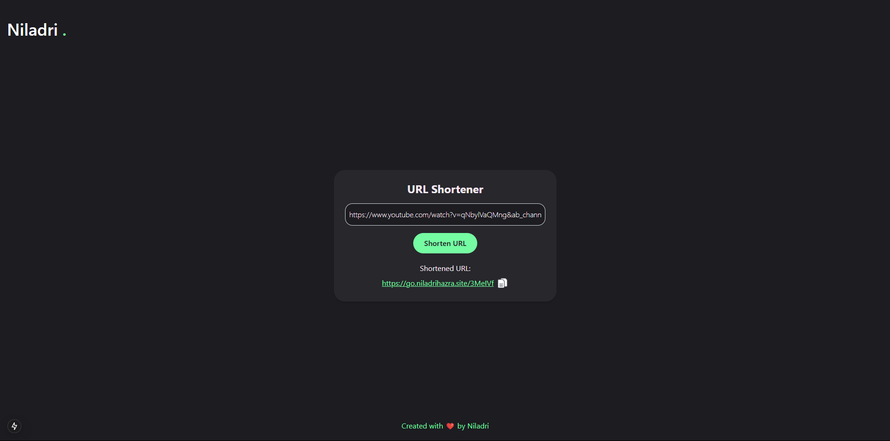

# URL Shortener

This is a simple and efficient URL shortener tool that allows you to shorten any URL with just a single click, without any ads or suspicious tracking.

## Features
- Shorten any URL easily
- No ads or tracking
- Fast and straightforward

 <!-- Assuming image.png is inside the 'public' folder -->

## How to Use
1. Enter the URL you want to shorten.
2. Click the "Shorten URL" button.
3. Copy your shortened URL and use it as needed.

## Created with ❤️ by Niladri

